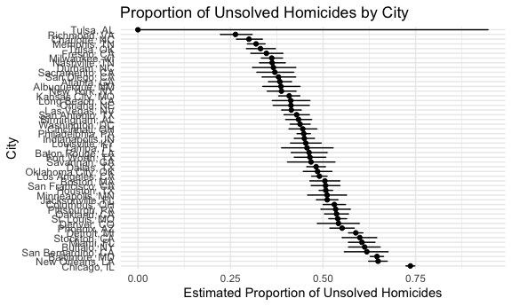

p8105_hw5_cw3555
================
Eunice Wang
2023-11-15

Load key packages.

``` r
library(tidyverse)
library(rvest)
```

    ## 
    ## Attaching package: 'rvest'

    ## The following object is masked from 'package:readr':
    ## 
    ##     guess_encoding

Set seed for reproducibility.

``` r
set.seed(12345)
```

### Problem 1

#### Load and describe the raw data.

``` r
homicide_data=
  read_csv("data/homicide-data.csv") |> 
  janitor::clean_names()
```

    ## Rows: 52179 Columns: 12
    ## ── Column specification ────────────────────────────────────────────────────────
    ## Delimiter: ","
    ## chr (9): uid, victim_last, victim_first, victim_race, victim_age, victim_sex...
    ## dbl (3): reported_date, lat, lon
    ## 
    ## ℹ Use `spec()` to retrieve the full column specification for this data.
    ## ℹ Specify the column types or set `show_col_types = FALSE` to quiet this message.

``` r
homicide_data
```

    ## # A tibble: 52,179 × 12
    ##    uid        reported_date victim_last  victim_first victim_race victim_age
    ##    <chr>              <dbl> <chr>        <chr>        <chr>       <chr>     
    ##  1 Alb-000001      20100504 GARCIA       JUAN         Hispanic    78        
    ##  2 Alb-000002      20100216 MONTOYA      CAMERON      Hispanic    17        
    ##  3 Alb-000003      20100601 SATTERFIELD  VIVIANA      White       15        
    ##  4 Alb-000004      20100101 MENDIOLA     CARLOS       Hispanic    32        
    ##  5 Alb-000005      20100102 MULA         VIVIAN       White       72        
    ##  6 Alb-000006      20100126 BOOK         GERALDINE    White       91        
    ##  7 Alb-000007      20100127 MALDONADO    DAVID        Hispanic    52        
    ##  8 Alb-000008      20100127 MALDONADO    CONNIE       Hispanic    52        
    ##  9 Alb-000009      20100130 MARTIN-LEYVA GUSTAVO      White       56        
    ## 10 Alb-000010      20100210 HERRERA      ISRAEL       Hispanic    43        
    ## # ℹ 52,169 more rows
    ## # ℹ 6 more variables: victim_sex <chr>, city <chr>, state <chr>, lat <dbl>,
    ## #   lon <dbl>, disposition <chr>

The raw data contains 52179 obervations (homicide cases) of 12
variables(including the date, location of each case,whether an arrest
was made and basic demographic characteristics of the victim). It
reported homicides in 50 large U.S. cities.

#### Create a city_state variable and then summarize.

``` r
city_summary=
  homicide_data |> 
  mutate(city_state=str_c(city,state,sep =", ")) |> 
  group_by(city_state) |> 
  summarize(
    total_homicides=n(),
    unsolved_homicides=sum(disposition %in% c("Closed without arrest","Open/No arrest"))
    )
```

#### For Baltimore, MD

Estimate the proportion of homicides that are unsolved.

``` r
baltimore_df=
  city_summary |> 
  filter(city_state=="Baltimore, MD") 

baltimore_prop_test=
  prop.test(
    x=pull(baltimore_df, unsolved_homicides),
    n=pull(baltimore_df, total_homicides)
  )
```

Save the output of prop.test as an R object, apply the broom::tidy to
this object and pull the estimated proportion and confidence intervals
from the resulting tidy dataframe.

``` r
baltimore_tidied=
  broom::tidy(baltimore_prop_test)

baltimore_output=
  baltimore_tidied |> 
  select(estimate,conf.low, conf.high)
```

- The estimated proportion of unsolved homicides in Baltimore is 0.646,
  and the confidence interval is (0.628,0.663)

#### For each cities

Now run prop.test for each of the cities in your dataset, and extract
both the proportion of unsolved homicides and the confidence interval
for each. Do this within a “tidy” pipeline, making use of purrr::map,
purrr::map2, list columns and unnest as necessary to create a tidy
dataframe with estimated proportions and CIs for each city.

``` r
city_output=
  city_summary |> 
  mutate(
    prop_test_output = 
      map2(
        unsolved_homicides,
        total_homicides,
        ~prop.test(x=.x,n=.y)
      ) 
  ) |> 
  mutate(tidied_output= map(prop_test_output, broom::tidy)) |> 
  unnest(tidied_output) |> 
  select(city_state,estimate,conf.low, conf.high)

head(city_output)
```

    ## # A tibble: 6 × 4
    ##   city_state      estimate conf.low conf.high
    ##   <chr>              <dbl>    <dbl>     <dbl>
    ## 1 Albuquerque, NM    0.386    0.337     0.438
    ## 2 Atlanta, GA        0.383    0.353     0.415
    ## 3 Baltimore, MD      0.646    0.628     0.663
    ## 4 Baton Rouge, LA    0.462    0.414     0.511
    ## 5 Birmingham, AL     0.434    0.399     0.469
    ## 6 Boston, MA         0.505    0.465     0.545

Create a plot that shows the estimates and CIs for each city – check out
geom_errorbar for a way to add error bars based on the upper and lower
limits. Organize cities according to the proportion of unsolved
homicides

``` r
city_output |> 
  ggplot(aes(x=reorder(city_state,-estimate), y=estimate))+
  geom_point()+
  geom_errorbar(
    aes(
      ymin= conf.low,
      ymax= conf.high),
      width=0.2)+
  coord_flip()+
  labs(
    title= "Proportion of Unsolved Homicides by City",
    x="City",
    y="Estimated Proportion of Unsolved Homicides")+
  theme_minimal()
```



We can see Chicago is the city with most unsolved homicides, whole Tulsa
is the city with fewest unsolved homicides.
